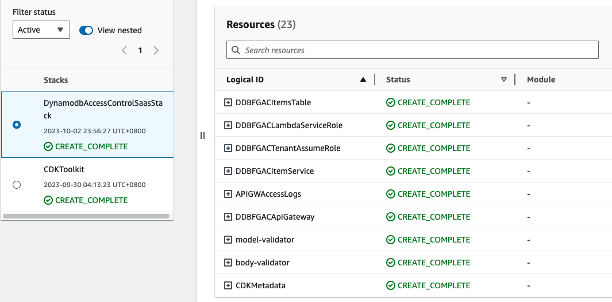
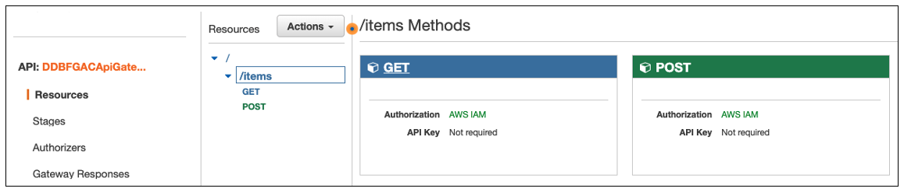

# Amazon DynamoDB fine-grained access control for multi-tenant SaaS

The purpose of this solution is to illustrate how [Amazon DynamoDB](https://aws.amazon.com/pm/dynamodb) tables can be shared across tenants in a multi-tenant SaaS (Software-as-Service) solution with enforced security. This implementation leverages DynamoDB fine-grained access control using a dynamically generated [AWS IAM](https://aws.amazon.com/iam/) policy. It ensures preventing the cross-tenant data access with shared DynamoDB tables, which also helps to control potential noisy neighbors at the storage layer. This repository provides necessary cdk scripts and sample code to illustrate this particular security mechanism. 

(Note that, you could also leverage strategies such as attribute-based access control (ABAC) and role-based access control (RBAC) that implement SaaS data isolation, which you can find more details from  [this blog post](https://aws.amazon.com/blogs/security/how-to-implement-saas-tenant-isolation-with-abac-and-aws-iam/)).

## Solution Architecture  
The below diagram shows what we are going to implement. It simulates a multi-tenant environment where we allow to store and manage data from different tenants with a shared DynamoDB table. It is fronted by a Lambda microservice that will be used by all tenants to perform DB operations. The microservice creates a DynamoDB client-connection which provides a scoped-access to the shared table using a dynamically generated IAM policy with tenant-context. Using this connection, the microservice ensures that each tenant will have the access to their own dataset to conduct DB operations preventing cross-tenant data access. During the testing of this solution, we will simulate the cross-tenant data access purposefully, and see how it would make sure to reject such operations. The Lambda microservice is fronted by the a REST API with Amazon API Gateway which has attached to an [IAM authorizer](https://docs.aws.amazon.com/apigateway/latest/developerguide/permissions.html) to protect the API resources from unauthorised access. In order to simulate client API calls from different tenants, we will use [in-build testing panel](https://docs.aws.amazon.com/apigateway/latest/developerguide/how-to-test-method.html#how-to-test-method-console) at the API Gateway console.


First, let's go through the solution workflow in the architecture. 
1. API Gateway console will send test requests to `/items` REST API endpoint that supports following operations 
   - `POST /items` with request body `{tenant_id}` - creates items in the DynamoDB table
   - `GET /items` with query string parameter `{tenant_id}` - fetches all items by tenant id 
   - `GET /items` with query string parameters `{tenant_id, product_id, shard_id}` - fetches the item specified by the given parameters
   
   Note that, Each request contains the `tenant_id` parameter to denote which tenant the requests belong to. Here, for testing purposes, we are using the request body and query parameters to pass through the `tenant_id` to the microservice. In real life, there are multiple ways of handling this scenario. One implementation strategy is to leverage a JSON Web Token that represent `tenant_id`, and pass it through to the downstream microservices seamlessly via HTTP headers in each request. 
2. API Gateway has a Lambda integration directing both `GET` and `POST` requests of of `/items` API resource to the same microservice.  
3. There are 2 IAM roles created via the CloudFormation stack 
   - `lambdaServiceRole`: Provides the [AWSLambdaBasicExecutionRole](https://docs.aws.amazon.com/lambda/latest/dg/lambda-intro-execution-role.html) as the service role for the Lambda function to be able to access necessary AWS services such as [AWS Cloudwatch](https://aws.amazon.com/cloudwatch/) and [AWS Security Token Service(STS)](https://docs.aws.amazon.com/STS/latest/APIReference/welcome.html).  
   - `tenantAssumeRole`: Specifies the generic access permission for the DynamoDB table. The idea would be to trim down the scope of the permission of this role to provide a more scoped access for the tenant-specific API operations. So, we make sure each tenant will conduct the DB operations only with their own tenant-specific dataset ensuring data isolation. The permission we specify with this role depends on the use-case. For the purpose of this solution, we are going to use it as follows. 
     ```json
       {
          "Version": "2012-10-17",
          "Statement": [
          {
            "Action": [
                "dynamodb:BatchGetItem",
                "dynamodb:BatchWriteItem",
                "dynamodb:DeleteItem",
                "dynamodb:GetItem",
                "dynamodb:PutItem",
                "dynamodb:Query",
                "dynamodb:UpdateItem"
            ],
            "Resource": DYNAMODB_TABLE_ARN,
            "Effect": "Allow"
          }]
       }
      ```
4. In order to modify the scope of the permissions of the `tenantAssumeRole`, the microservice dynamically generates a tenant-aware IAM policy as follows. This policy allows to execute the specified DB operations with a selected dataset where partition key (Shard Id) of the DynamoDB table is leading/starting with the value of `TENANTID` of the API request. In order to make this happen, the microservice will pass this policy along with the `tenantAssumeRole` to the [AssumeRole API](https://docs.aws.amazon.com/STS/latest/APIReference/API_AssumeRole.html) in AWS STS.
   ```json
   {
           "Version": "2012-10-17",
           "Statement": [
               {
                   "Effect": "Allow",
                   "Action": [
                       "dynamodb:GetItem",
                       "dynamodb:PutItem"
                   ],
                   "Resource": [
                       DYNAMODB_TABLE_ARN
                   ],
                   "Condition": {
                       "ForAllValues:StringLike": {
                           "dynamodb:LeadingKeys": [
                               "{TENANTID}-*"
                           ]
                       }
                   }
               }
           ]
       }
    ```

5. AWS STS uses the above IAM policy to trim down the permission of `tenantAssumeRole` that refers to a tenant-specific, scoped-access to the DynamoDB table. AssumeRole API will then convert it to a [STS Credentials](https://docs.aws.amazon.com/STS/latest/APIReference/API_Credentials.html) object that includes `AccessKeyID`, `SecretAccessKey` and a `SessionToken` that represents the tenant-wise permission and access to the table 
6. Finally, the microservice leverages this STS credentials object to initialize a scoped DynamoDB client connection which specifically has the access only to the dataset belong to the given tenant for DB operations. This way, it will enforce to restrict one tenant accessing other tenants' data in the shared table 

For more details about this design pattern, please refer to this blog post:  [Partitioning Pooled Multi-Tenant SaaS Data with Amazon DynamoDB](https://aws.amazon.com/blogs/apn/partitioning-pooled-multi-tenant-saas-data-with-amazon-dynamodb/)

Also, in order to generate the dynamic IAM policy and STS tokens at scale, evaluate a Token vending machine pattern explained in this blog post: [Isolating SaaS Tenants with Dynamically Generated IAM Policies
](https://aws.amazon.com/blogs/apn/isolating-saas-tenants-with-dynamically-generated-iam-policies/) 

## Setup Instructions 
Pls refer the following setup instructions to deploy the solution via your laptop/computer or an [AWS Cloud9](https://aws.amazon.com/cloud9) environment. 
1. [Install AWS CLI V2.0](https://docs.aws.amazon.com/cli/latest/userguide/install-cliv2.html)
2. [Install npm and node with latest versions](https://docs.npmjs.com/downloading-and-installing-node-js-and-npm)
3. [Install AWS CDK](https://docs.aws.amazon.com/cdk/v2/guide/cli.html) 

## Build and Deployment instructions
1. Clone this repository to your environment. This solution is a CDK project, and following are some important files and resources to note.
   - `./bin/main.ts` : The entry point that initializes the CDK project via the `./package.json`
   - `./lib/dynamodb-access-control-saas-stack.ts` : The main CDK stack that creates, configures and integrates the AWS infrastructure needed to run the solution 
   - `./resources/lambda_function.py` : The content of the Lambda function for the ItemService microservice
   - `./setup.sh` : The setup file that cleans, builds and deploys the CDK project on the AWS Account configured with AWS CLI 
2. Run the setup file as follows on a terminal and follow the in-line instructions
     ```shell script
     $ sh setup.sh 
     ```
3. Provide the AWS region the solution has to be deployed to
     ```
     Enter the AWS region name you want to deploy the solution below (Just press Enter if it's for us-east-1) : us-west-1 
     ```
4. The stack will then build the solution and deploy it on the given region. Checkout the terminal output for the verbose logs of the process, or, refer the AWS CloudFormation Service console for the status.  
5. Once the deployment is finished, the terminal will show a confirmation as follows with the CDK output. 
      
    
    If you look at the AWS CloudFormation console in your region, you will find the deployed resources in the stack as follows 
    

## Testing the Solution
For testing, we are going to use the in-built testing panel at the [Amazon API Gateway console](https://console.aws.amazon.com/apigateway/). It will allow us to simulate the API testing securely with no authorization details required, following the same API request/response format. Read more about it [here](https://docs.aws.amazon.com/apigateway/latest/developerguide/how-to-test-method.html#how-to-test-method-console).
1. First, lets have a look of the DynamoDB Table and Lambda microservice that we just created 
   - Open the AWS CloudFormation console of the region, point to the stack `DynamodbAccessControlSaasStack` and refer the link to the table from `DDBFGACItemsTable` item in the Resources tab.
   - Access the Lambda microservice logic from `DDBFGACItemService` resource in the CloudFormation stack

2. Let's open up the REST API endpoint that we created in the API Gateway console.
   - From the CloudFormation stack, expand the `DDBFGACApiGateway` resource that will provide a link to open the API Gateway resource `/items`. You can also access it from the API Gateway console directly by clicking `DDBFGACApiGateway` API name
   - Click `/items` API resource which will show you the `GET` and `POST` methods as follows, and note both are secured with `AWS IAM Authorizatoin`
   

3. It's time to load some data into the DynamoDB Table for `tenant1`. 
   - For that, we need to send a `POST` request to `/items` API endpoint. Click `POST` under `/items` which will open up the method execution flow. Click the link `TEST` in the first section there that opens up the testing panel
   
   - This `POST` endpoint expects to have `tenant_id` in the request body to create new items in the Dynamo table under given tenant. In this solution, We are loading 3 items per POST request. 
   - Let's load items for `tenant1`. Add the following parameters in the `Request Body` section and click the button `Test` at the end of the panel 
   ```
   {"tenant_id": "tenant1"}  
   ```   
   - The API will respond with the partition keys of the new items created as follows, and you can see that output as the `Response Body` at the right side of the testing panel itself. 
   ```
   Operation Success. Items with these Shard Ids created : 
   tenant1-5,tenant1-6,tenant1-19
   ```

4. From the same testing panel (`POST` of `/items`), load some data for `tenant2` as well. For that, use the following request body parameter 
   ```
    {"tenant_id": "tenant2"}  
   ```   
   - Once done, if you check out the DynamoDB table, our test dataset would look like as follows.
    
   - Note that there is a random suffix that you can find in the format of `tenant_id-suffix` for each ShardID(partition key). It will help to distribute the data set of each tenant randomly for multiple physical partitions via unique partition keys. This trick specifically helps to control the potential hot partitions in the shared table for larger data-sets due to noisy neighbors. Refer the section of "Addressing the Hot Partition Challenge" in [this blog](https://aws.amazon.com/blogs/apn/partitioning-pooled-multi-tenant-saas-data-with-amazon-dynamodb/), or [here](https://docs.aws.amazon.com/amazondynamodb/latest/developerguide/bp-partition-key-sharding.html) for more details.
   
5. We have made the `POST /items` API implementation tenant-specific, so, it enforce to create items only related to the tenant id specified by the request 
   - If you look at the code in the Lambda microservice, The entry point of this implementation would look liks this. 
    ```python
       def _create_test_items(tenant_id, no_of_items):
            shard_ids = []
            table = _get_scoped_ddb_table_by_tenant(tenant_id)
            # Load 3 new items for a given tenantID in the Dynamo Table
            for x in range(0, no_of_items):
                shard_id = tenant_id + '-' + str(_get_shard_suffix())
                shard_ids.append(shard_id)
                _put_item(table, shard_id, _get_product_id())
            return ','.join(shard_ids)

    ```
   - The `_get_scoped_ddb_table_by_tenant` function that it refers is the key implementation here, that helps to create the DynamoDB object that provides the scoped access to the table for the given tenant_id. The function contains the logic as follows 
    ```python
       def _get_scoped_ddb_table_by_tenant(tenant_id):
           # Step 01 : Creates the IAM policy document that defines operations that can be performed targeting
           # a tenant specific dataset in the DynamoDB table 
           sts_client = boto3.client("sts", region_name=AWS_REGION_NAME)
           assumed_role = sts_client.assume_role(
               RoleArn = DYNAMO_ASSUME_ROLE_ARN,
               RoleSessionName = "tenant-aware-product",
               Policy = get_policy(tenant_id),
           )
           # Step 02 : Extracts the short-living credentials
           credentials = assumed_role["Credentials"]
    
           # Step 03 : Creates a scoped DB session that has the access to the dataset belong to given tenant ID
           session = boto3.Session(
               aws_access_key_id=credentials['AccessKeyId'],
               aws_secret_access_key=credentials['SecretAccessKey'],
               aws_session_token=credentials["SessionToken"],
           )
    
           # Step 04 : Cretaes the DDB table object from the scoped session that can perform DB operations
           dynamodb = session.resource('dynamodb', region_name=AWS_REGION_NAME)
           table = dynamodb.Table(DYNAMO_TABLE_NAME)
    
           return table;

    ```
   - This is where the fine-grained access control is in action to make it a tenant-specific operation. Here, we are passing the value `tenant_id` to fill the placeholder `{TENANTID}` in the dynamic IAM policy that we discussed during the step 04 in the "Solution Architecture" section. Then, we are using that policy to create credentials object which helps to create the DynamoDB `table` object that has the tenant-specific scoped access to the table. This way, we explicitly ensure the items we creating only belong to the tenant specified by tenant_id. 
   - We will reuse the `_get_scoped_ddb_table_by_tenant` function for other API operations such as `GET /items`, so they would ensure the enforced security as well. 

6. Let's fetch the full dataset of `tenant1` the table via the API. 
   - Get back to `/items` resource in the API Gateway console and open up the TEST panel for the `GET` method.  
   - Enter the following parameters as the `Query String` and hit the button `TEST` for the API call to query the table and fetch all the items of tenant1. 
   ```
   tenant_id=tenant1
   ```
   - It will result the following output in the Response body of the panel 
   ```
   Operation Success. Items : 
   [[{'ProductId': {'S': '18983'}, 'ShardID': {'S': 'tenant1-6'}, 'data': {'S': '{sample data}'}}, 
   {'ProductId': {'S': '16776'}, 'ShardID': {'S': 'tenant1-5'}, 'data': {'S': '{sample data}'}}, 
   {'ProductId': {'S': '15700'}, 'ShardID': {'S': 'tenant1-19'}, 'data': {'S': '{sample data}'}}]]
   ```    
   - In the Lambda microservice, check out the `_get_all_items_by_tenantId` function logic, which will look like as follows  
   - Note that it fetches the dataset by each partition key separately, using a multi-threaded model to make sure we explicitly refer the tenant-specific dataset in a more efficient way 
   ```python
   def _get_all_items_by_tenantId(tenant_id):
    threads = []
    get_all_items_response.clear()

    for suffix in range(SUFFIX_START, SUFFIX_END + 1):
        partition_id = tenant_id+'-'+str(suffix)
        thread = threading.Thread(target=get_tenant_data, args=[partition_id])
        threads.append(thread)

    # Start threads
    for thread in threads:
        thread.start()
    # Ensure all threads are finished
    for thread in threads:
        thread.join()

    return get_all_items_response
   ```
   - Checkout the `get_tenant_data` function in the Lambda microservice, that acts as the target for each thread, which queries the DynamoDB table by partition key (shared id)
   - It has also leveraged the same `get_scoped_ddb_table_by_tenant` function described in the previous step to make sure the DB operation has a tenant-specific scoped access 


7. In order for us to access a given item in the DB uniquely, we need to know 2 data points. `ShardID` - which is the partition key of the Item, that has the format of `tenant_id-suffix`, and, the `ProductId` - which is a unique identifier given per Item, per tenant basis. Let's try to access an Item from the table. Now, this is purely a simulation of a tenant accessing its own data from the shared table. 
   - Add the following parameters as the Query string in the `GET /items` testing panel. We have taken the values for the parameters from the JSON response of the previous step
    ```
   tenant_id=tenant1&shard_id=tenant1-6&product_id=18983
     ```
   - This will fetch the correct Item object as follows, because here the tenant1 trys to access an item of its own
   ```
   Operation Successful. 
   {'ProductId': '18983', 'ShardID': 'tenant1-6', 'data': '{sample data}'}
   ```
   - If you refer to the `_get_item_by_primarykey` function in the Lambda code, you will note that this API call is also leveraging `get_scoped_ddb_table_by_tenant` function described above in the 5th step to enforce the tenant-specific access control.
   - Change the `shard_id` and `product_id` based on your own DynamoDB table items, and try out the API call. It should return the correct Item object without any issue. 
   
8. Now, let's simulate the cross-tenant data access and see what happens. Send a `GET` request with the following query string parameters. Note that we are requesting the same Item object as above, but with a different tenant (`tenant_id=tenant2`) this time.  
   ```
   tenant_id=tenant2&shard_id=tenant1-6&product_id=18983
   ```
    
   The output at the Response body should look like something similar to this :  
     ``` python
        Operation Failed. 
        Traceback (most recent call last):
          File "/var/task/lambda_function.py", line 36, in _get_item
            item =  _get_item_by_primarykey(params['shard_id'], params['product_id'], params['tenant_id']);
          File "/var/task/lambda_function.py", line 88, in _get_item_by_primarykey
            response = table.get_item(
          File "/var/lang/lib/python3.11/site-packages/boto3/resources/factory.py", line 580, in do_action
            response = action(self, *args, **kwargs)
          File "/var/lang/lib/python3.11/site-packages/boto3/resources/action.py", line 88, in __call__
            response = getattr(parent.meta.client, operation_name)(*args, **params)
          File "/var/lang/lib/python3.11/site-packages/botocore/client.py", line 534, in _api_call
            return self._make_api_call(operation_name, kwargs)
          File "/var/lang/lib/python3.11/site-packages/botocore/client.py", line 976, in _make_api_call
            raise error_class(parsed_response, operation_name)
        botocore.exceptions.ClientError: An error occurred (AccessDeniedException) when calling the GetItem operation: User: arn:aws:sts::xxxxxxxxxxxx:assumed-role/DynamodbAccessControlSaas-DDBFGACTenantAssumeRole9-xxxxxxxxxxxx/tenant-aware-product is not authorized to perform: dynamodb:GetItem on resource: arn:aws:dynamodb:us-west-1:xxxxxxxxxxxx:table/DynamodbAccessControlSaasStack-DDBFGACItemsTable4E79F4D0-xxxxxxxxxxxx because no session policy allows the dynamodb:GetItem action
     ``` 
    
     The `AccessDeniedException` is due to the cross-tenant data access where `tenant2` is trying to access data belong to `tenant1`. Even though the DynamoDB table contains data of different tenants, the dynamically generated tenant-specific IAM policy and STS tokens enforce the security by preventing one tenant accessing the data belong to other tenants. 
      
      If we simulate the cross-tenant data access for other API operation this solution supports such with `POST /items` and `GET /items` for fetching all items, they would also behave the similar way ensuring the enforced data isolation. 

 Thus, The fine-grained access control with shared DynamoDB tables could be used as a security enforcement for implementing tenant-specific data isolation strategy with multi-tenant SaaS solutions.


## License
This library is licensed under the MIT-0 License. See the LICENSE file.

